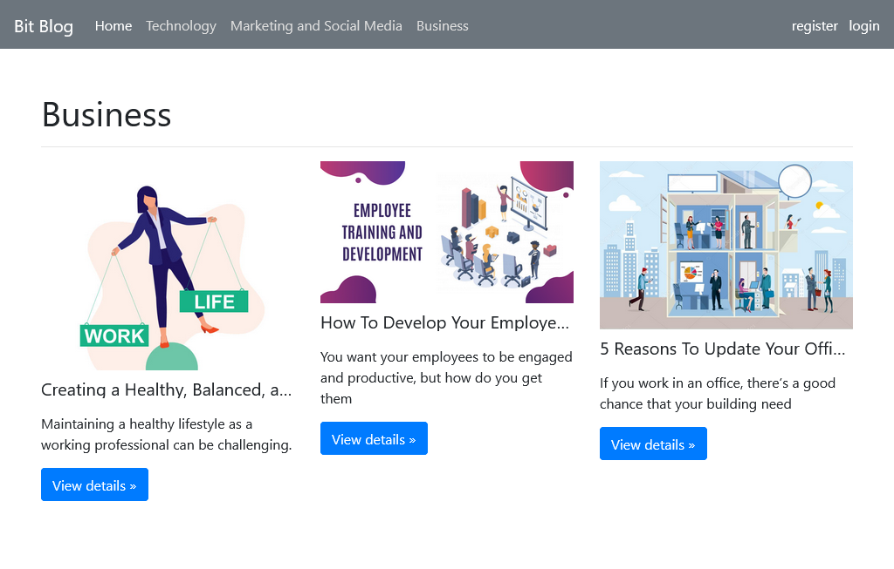
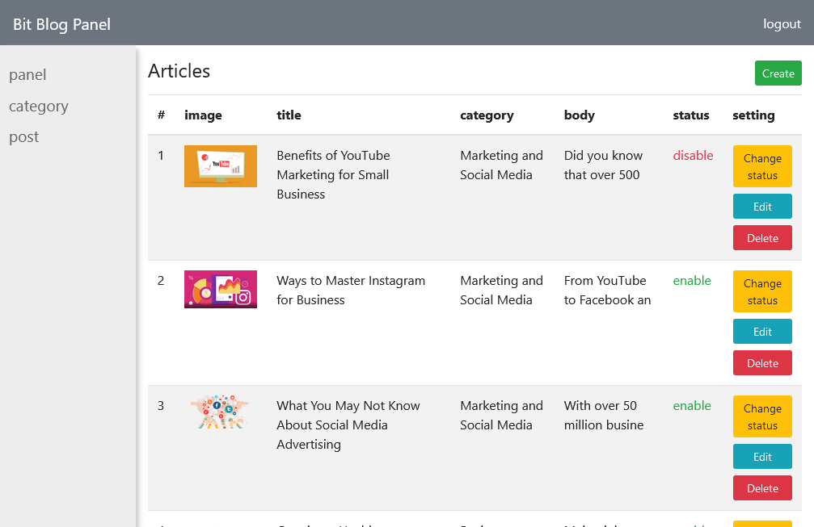

# Bit Blog
Blog simple en PHP

## Tabla de Contenidos
* [Información General](#información-general)
* [Tecnologías Usadas](#tecnologías-usadas)
* [Características](#características)
* [Capturas de Pantalla](#capturas-de-pantalla)
* [Configuración](#configuración)
* [Uso](#uso)
* [Estado del Proyecto](#estado-del-proyecto)

## Información General

BitBlog ("weblog") es un sencillo diario en línea que puede ser gestionado por una sola persona y proporciona actualizaciones regulares (entradas de blog) sobre diversos temas.

Los posts se presentan en orden cronológico inverso y está escrito con PHP 8.1.

## Tecnologías Usadas
- PHP 8.1.10

## Características
Lista de las características disponibles:
- Crear, leer, actualizar y eliminar publicaciones.
- Cambiar el estado (habilitar o deshabilitar).
- Crear y editar categorías.
- Ver detalles.

## Capturas de Pantalla

## Configuración
1. Instala XAMPP o WAMPP.

2. Abre el panel de control de XAMPP y inicia [Apache] y [MySQL].

3. Descarga el proyecto desde GitHub (https://github.com/MobinaJafarian/BitBlog)  
    O sigue los comandos de Git Bash:

    i>cd C:\\xampp\htdocs\
    
    ii>git clone https://github.com/MobinaJafarian/BitBlog.git
    
4. Extrae los archivos en C:\\xampp\htdocs\.

5. Abre el enlace localhost/phpmyadmin.

6. Haz clic en "Nuevo" en la barra lateral.

7. Asigna un nombre a la base de datos como (bit-blog) y haz clic en "Crear".

8. Después de crear la base de datos, haz clic en "Importar".

9. Busca el archivo en el directorio [BitBlog/assets/database/bit-blog.sql].

10. Después de importar correctamente.

11. Abre cualquier navegador y escribe http://localhost/BitBlog/

12. Primero regístrate y luego inicia sesión.

13. Detalles de inicio de sesión de administrador:
- Correo electrónico = admin@gmail.com 
- Contraseña = 123456

## Uso

`php -S localhost:8000`

## Estado del Proyecto
El proyecto está: _completo_
